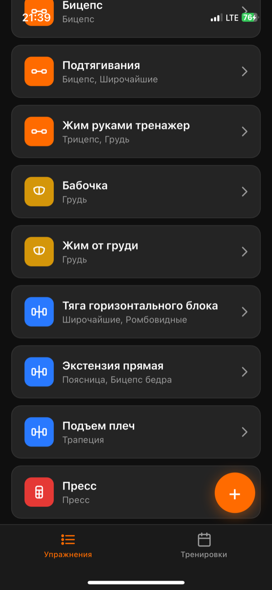
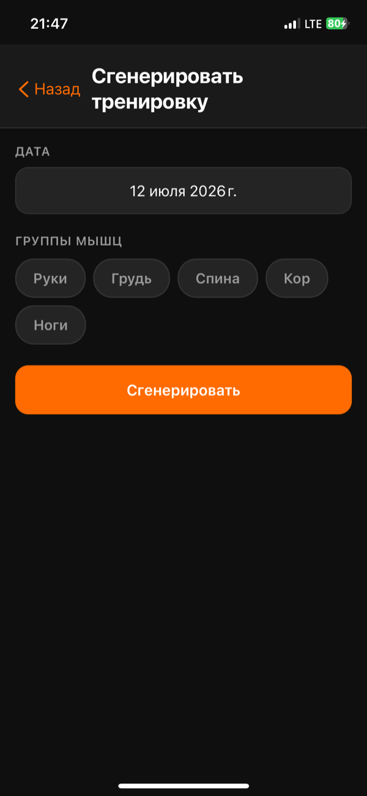
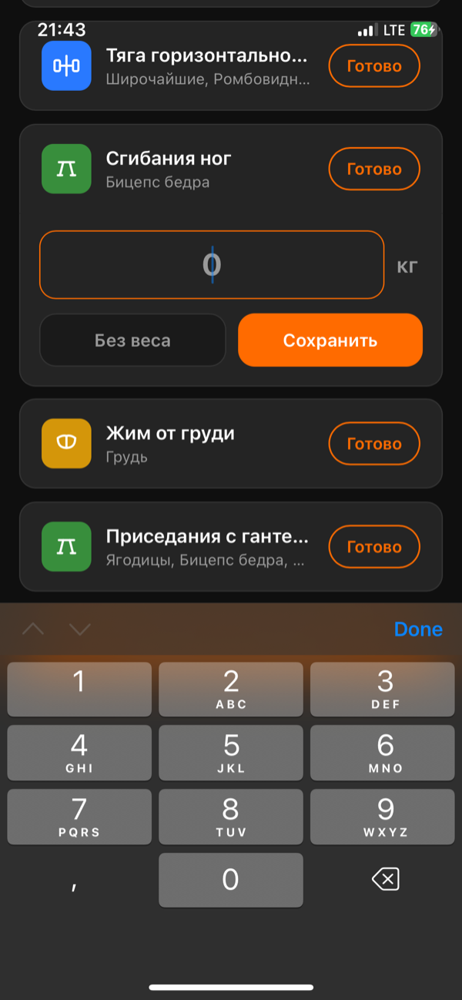
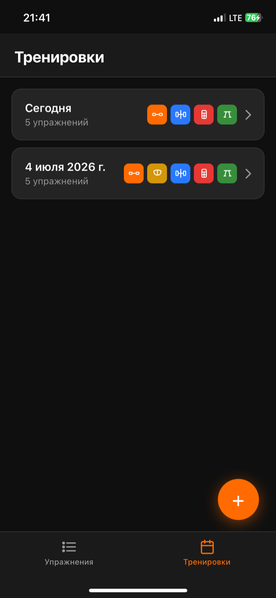
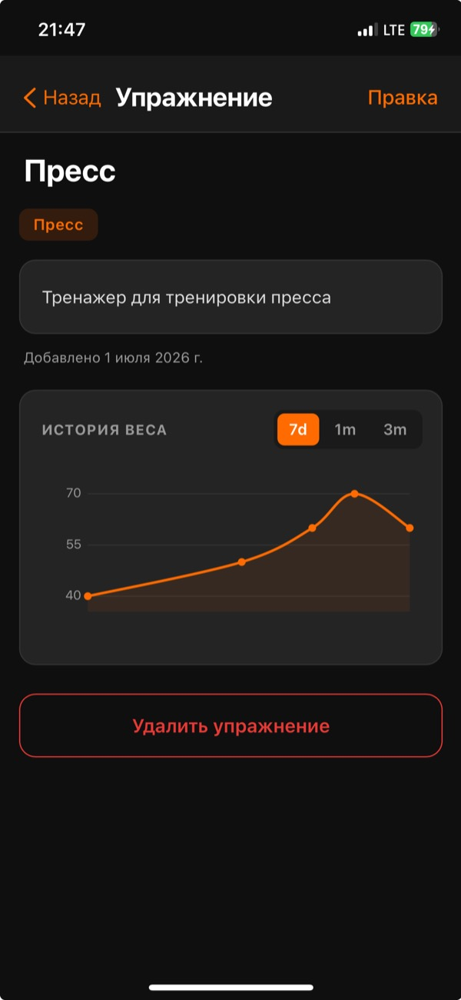
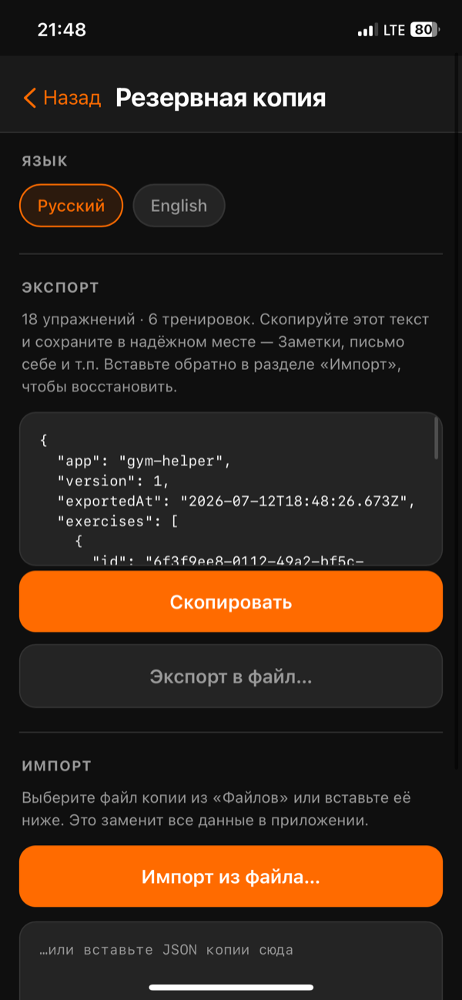

# Gym Helper

Персональный трекер тренировок. Ведёт библиотеку упражнений, собирает и генерирует тренировки, записывает рабочие веса и показывает прогресс.

Одна кодовая база — два способа запуска: приложение **открывается как обычная веб-страница в браузере** и **оборачивается в нативное iOS-приложение** через `WKWebView`. Чистые HTML/CSS/JS: без бэкенда, без аккаунтов, без зависимостей и без шага сборки. Все данные живут только на устройстве.

---

## Скриншоты

|  |  |  |
|:---:|:---:|:---:|
| **Библиотека упражнений** | **Генератор по группам мышц** | **Активная тренировка** |

|  |  |  |
|:---:|:---:|:---:|
| **История тренировок** | **История веса** | **Язык и бэкапы** |

---

## Что это

Гибридное iOS-приложение: вся логика и интерфейс написаны на чистых HTML/CSS/JS, а тонкая обёртка на Swift открывает их в `WKWebView` на весь экран. Снаружи — обычное нативное приложение, внутри — веб-страница, работающая офлайн.

Такой подход даёт разработку прямо в браузере, мгновенную сборку (нет шага компиляции веб-части) и полный контроль над UI.

---

## Возможности

### 📚 Библиотека упражнений
- Своя карточка на каждое упражнение: название, описание, целевые мышцы.
- **14 мышц**, сгруппированных в **5 групп**: Руки, Грудь, Спина, Кор, Ноги.
- У каждой группы свой цвет и минималистичная SVG-иконка.
- Список автоматически сортируется по группам мышц (Руки → Грудь → Спина → Кор → Ноги).

### Тренировки
Два способа собрать тренировку:

- **Вручную** — выбрать дату и добавить упражнения из списка (или создать новое прямо на ходу).
- **Сгенерировать** — отметить группы мышц, и приложение само подберёт до 5 упражнений.

### Умный генератор
Алгоритм учитывает историю тренировок:

- **Не повторяет одно и то же упражнение** в близких тренировках на одну группу, если есть альтернатива. Например, в цепочке «руки → ноги → руки» второй раз выпадет другое упражнение на трицепс.
- **Распределяет нагрузку по мышцам**: мышцы, которые были нагружены недавно, получают более низкий приоритет.
- **Не берёт два одинаковых по смыслу упражнения** в одну тренировку — если два упражнения задействуют ровно один набор мышц, попадёт только одно.
- **Честно делит места между группами** — при выборе нескольких групп каждая получит свою долю.

### Активная тренировка
- Пользователь отмечает каждое упражнение как выполненное по ходу занятия.
- Вводит рабочий вес — поле **автоматически подставляет вес с прошлого раза**, чтобы не вспоминать.
- Есть режим «без веса» для упражнений с собственным весом.
- Невыполненные упражнения **не сохраняются** — в историю попадает только то, что было реально сделано.

### Прогресс
- **Дельта веса**: в завершённой тренировке рядом с каждым упражнением видно изменение относительно прошлого раза — `+2.5 кг` зелёным или `−5 кг` красным.
- **График истории веса** на странице упражнения: плавная кривая (сплайн Catmull-Rom) с переключателем периода — **7 дней / 1 месяц / 3 месяца**.
- В списке тренировок у каждой завершённой сессии — строка иконок проработанных групп мышц.

### Два языка
Русский (по умолчанию) и английский, переключаются в настройках. Переведено всё, включая правильные склонения и форматы дат.

### Резервные копии
Данные лежат в `localStorage` внутри контейнера приложения, а он стирается при удалении приложения. Поэтому есть полноценный бэкап:

- **Экспорт** — весь набор данных в JSON: скопировать в буфер или **сохранить файл в «Файлы» / iCloud Drive** через системное меню «Поделиться».
- **Импорт** — выбрать файл через системный пикер или вставить JSON текстом. С подтверждением перед перезаписью.

---

## Стек

- **Веб-часть** — vanilla HTML/CSS/JS. Ни фреймворков, ни сборщика, ни npm.
- **Хранилище** — `localStorage` (ключи `gym_exercises`, `gym_workouts`, `gym_lang`).
- **Нативная оболочка** — SwiftUI + `WKWebView` (`ContentView.swift`), iOS 16+.
- **Мост JS ↔ Swift** — `WKScriptMessageHandler` для экспорта (share sheet) и импорта (файловый пикер).

---

## Структура

```
gym_helper/
├── ContentView.swift   # Swift-обёртка: WKWebView + мост для бэкапов
├── web/                # вся веб-часть (в Xcode — folder reference, «синяя папка»)
│   ├── index.html      # оболочка страницы, подключает скрипты по порядку
│   ├── style.css       # тёмная тема, mobile-first, safe-area
│   ├── i18n.js         # переводы, склонения, t()
│   ├── store.js        # данные: localStorage, CRUD, бэкап, генератор
│   ├── ui.js           # UI-примитивы: иконки, график, модалки, таб-бар
│   ├── views.js        # экраны (все render*)
│   └── app.js          # роутер и точка входа
├── manifest.json       # PWA-манифест (для веба; iOS его игнорирует)
└── CLAUDE.md           # техническая документация
```

Пять JS-файлов подключаются как **классические `<script>`** (не ES-модули — `WKWebView` блокирует загрузку модулей с `file://`) в строгом порядке: `i18n → store → ui → views → app`.

---

## Как запустить

### В браузере (быстрая проверка)
Открыть `web/index.html` — приложение работает как обычная веб-страница. Не будет только нативных функций (сохранение файла в «Файлы»).

### На iPhone
1. Новый проект в Xcode → iOS App, SwiftUI.
2. Добавить папку `web` как **folder reference** («Create folder references» — синяя папка), отметив таргет.
3. Убедиться, что папка попала в **Build Phases → Copy Bundle Resources**.
4. Заменить сгенерированный `ContentView.swift` на файл из репозитория.
5. Deployment target — **iOS 16.0**.
6. ⌘R.

Подробности и подводные камни — в [CLAUDE.md](CLAUDE.md).

---

## Модель данных

```js
// gym_exercises
[{ id, name, description, categories: string[], createdAt }]

// gym_workouts
[{ id, date, exerciseIds: string[], weights: { [id]: number | null },
   finishedAt: string | null, createdAt }]
```

Тренировки хранят только ссылки на упражнения. `weights` — килограммы или `null` (собственный вес). `finishedAt` отличает завершённую тренировку от собираемой.

---

## Приватность

Данные никуда не уходят. Нет сети, нет сервера, нет телеметрии. Единственный способ вынести данные наружу — самому нажать «Экспорт».

---

## Лицензия

[MIT](LICENSE) — можно свободно использовать, изменять и распространять, сохранив упоминание автора.
